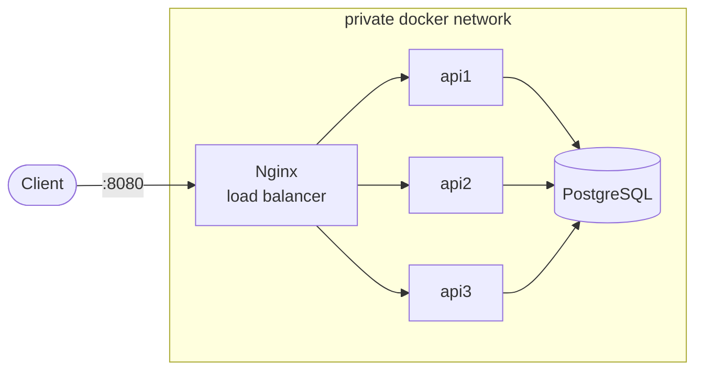

# Automated Deployment of a Multi-Service Web Application

<table>
  <tr><td>Team</td><td>Timur Daminov • Mikail Khamkhoev • Almir Avkhadiev • Anton Bugaev</td></tr>
  <tr><td>Topic</td><td>Automated Deployment of a Multi-Service Web Application with CI/CD</td></tr>
  <tr><td>Stack</td><td>Docker, Docker Compose, Nginx, FastAPI, PostgreSQL, GitHub Actions</td></tr>
</table>

## Goal and Tasks

### Goal

Build a small but realistic deployment. A FastAPI service backed by PostgreSQL, three replicas behind an Nginx reverse proxy, persistent storage, secrets kept out of git, and a GitHub Actions pipeline that builds, tests, and ships the image.

### Tasks

1. Implement the FastAPI service with a CRUD surface, liveness and readiness probes.
2. Package it in a hardened container image.
3. Orchestrate the full stack with Docker Compose and run database migrations as a one-shot step.
4. Configure Nginx as a real reverse proxy with load balancing and transparent failover.
5. Wire up CI for lint, tests, smoke build, image push, and security scans.

### Division of responsibilities

| Member | Area |
|---|---|
| Timur Daminov | Application code, database layer, migrations |
| Mikail Khamkhoev | Image build and runtime hardening |
| Almir Avkhadiev | Reverse proxy, networking, Compose orchestration |
| Anton Bugaev | CI/CD, tests, security scans |

---

## Execution Plan and Methodology

### System overview

Traffic enters Nginx, which spreads requests across three identical FastAPI replicas using a `least_conn` upstream with HTTP keepalive. The replicas talk to PostgreSQL over async SQLAlchemy. A separate one-shot container runs Alembic migrations at startup, and the replicas wait for it to finish before serving traffic. Only Nginx publishes a port to the host. PostgreSQL and the replicas stay on a private Docker network.



Configuration lives in [`docker-compose.yml`](./docker-compose.yml) and [`nginx/nginx.conf`](./nginx/nginx.conf).

### Implementation plan

1. Build the FastAPI service with async SQLAlchemy, typed configuration, and JSON logging. Add an `X-Served-By` response header so balancing is visible from outside. See [`app/`](./app/).
2. Run Alembic migrations in a dedicated one-shot container so they apply exactly once per release. See [`alembic/`](./alembic/).
3. Configure Nginx with `least_conn`, keepalive, passive health checks, transparent retry on upstream errors, rate limiting, and security headers.
4. Harden the image. Multi-stage build, non-root user, dropped Linux capabilities, read-only root filesystem. See [`Dockerfile`](./Dockerfile).
5. Keep secrets in `.env`, gitignore it, commit only the template. See [`.env.example`](./.env.example).
6. Wire up CI. Lint, type-check, run `pytest` against a real PostgreSQL service container, smoke-test the full stack, push the image to GHCR. A separate workflow runs gitleaks, Trivy, and hadolint. See [`.github/workflows/`](./.github/workflows/).

### Key design choices

- Async SQLAlchemy with `asyncpg` matches the FastAPI event loop and avoids thread-pool stalls.
- Migrations live in a dedicated container, not in the API startup path. This removes a race we hit early on.
- `least_conn` over round-robin. Under uneven load it stops piling work onto an already busy replica.
- Three small security tools instead of one big one. Each stays fast and covers a different concern.

---

## Development and PoC Tests

The stack is brought up with `docker compose up -d --wait`. The scenarios below were run on a clean machine with Docker Engine 27.4.

**1. Bring the stack up.**

```bash
cp .env.example .env
docker compose up -d --build --wait --wait-timeout 240
```

All containers reach `Healthy`. The migration container exits with status 0 before the replicas start serving.

**2. Liveness and readiness through the load balancer.**

```bash
curl -s http://localhost:8080/api/v1/healthz   # {"status":"ok","instance":"apiN"}
curl -s http://localhost:8080/api/v1/readyz    # {"status":"ready","instance":"apiN"}
```

`/readyz` runs `SELECT 1` against PostgreSQL inside the request, so a 200 also confirms the API-to-database path through the proxy.

**3. CRUD against the real database.**

```bash
curl -sX POST http://localhost:8080/api/v1/items \
  -H 'content-type: application/json' \
  -d '{"name":"smoke-1","quantity":3,"description":"compose smoke"}'

curl -s 'http://localhost:8080/api/v1/items?limit=10'
```

Returned `201 Created` followed by a paginated list including the new row.

**4. Load balancing distribution.**

```bash
for i in $(seq 1 12); do
  curl -s -o /dev/null -D - http://localhost:8080/api/v1/healthz |
    grep -i '^x-served-by'
done | sort | uniq -c
```

Measured distribution over 12 requests.

```
4 x-served-by: api1
4 x-served-by: api2
4 x-served-by: api3
```

**5. Transparent failover.**

```bash
docker compose stop api2
for i in $(seq 1 12); do
  curl -s -o /dev/null -w "%{http_code}\n" http://localhost:8080/api/v1/healthz
done
```

All twelve responses were `200`. After restarting `api2` and waiting past `fail_timeout`, the distribution returned to even.

**6. Persistence across `compose down`.**

```bash
curl -s 'http://localhost:8080/api/v1/items?limit=100' | jq '.total'
docker compose down
docker compose up -d --wait
curl -s 'http://localhost:8080/api/v1/items?limit=100' | jq '.total'
```

The row count survives because PostgreSQL state lives on a Docker named volume.

**7. Automated test suite.**

```bash
pytest -q --cov=app
```

```
9 passed
TOTAL  258 statements, 46 missed, 82% coverage
```

**8. CI and security pipelines.** GitHub Actions runs lint, type-check, `pytest` against a PostgreSQL service container, a Compose smoke build, and an image push to GHCR with provenance and SBOM. A separate workflow runs gitleaks, Trivy on filesystem and image, and hadolint. See [`.github/workflows/ci.yml`](./.github/workflows/ci.yml) and [`.github/workflows/security.yml`](./.github/workflows/security.yml).

---

## Difficulties Faced and Skills Acquired

### Difficulties

Alembic's stock environment builds a sync engine and does not work against `asyncpg`, so the migration environment had to be rewritten around an async engine. The replicas raced PostgreSQL at startup and exited with connection errors, which we fixed with `depends_on` healthchecks plus a bounded retry inside the application. Switching from bind mounts to a named volume removed host-coupling on database files. A read-only root filesystem broke Uvicorn until we mounted a small tmpfs at `/tmp`. Passive Nginx health checks let one request slip through to a dead backend before `max_fails` trips, so we widened `proxy_next_upstream` to retry on 502, 503, and 504. Finally, the starter committed `.env` to git. We purged it from the index, replaced it with a template, and added gitleaks to CI so this cannot regress silently.

### Skills acquired

Building an async-first FastAPI service with typed settings and async SQLAlchemy. Writing Alembic migrations against an async engine. Hardening a container image with non-root, capability drops, and a read-only filesystem. Running Nginx as a real reverse proxy with health checks and rate limiting. Wiring up a GitHub Actions pipeline with service containers, image push to GHCR, and SARIF uploads from security scanners.

---

## Conclusion

The project delivers what the topic asked for. A FastAPI service runs as three replicas behind an Nginx reverse proxy, with PostgreSQL on a Docker named volume and secrets outside of git. A CI pipeline lints, tests, smoke-builds, scans, and ships the image. Balancing and failover are visible from outside the cluster.
